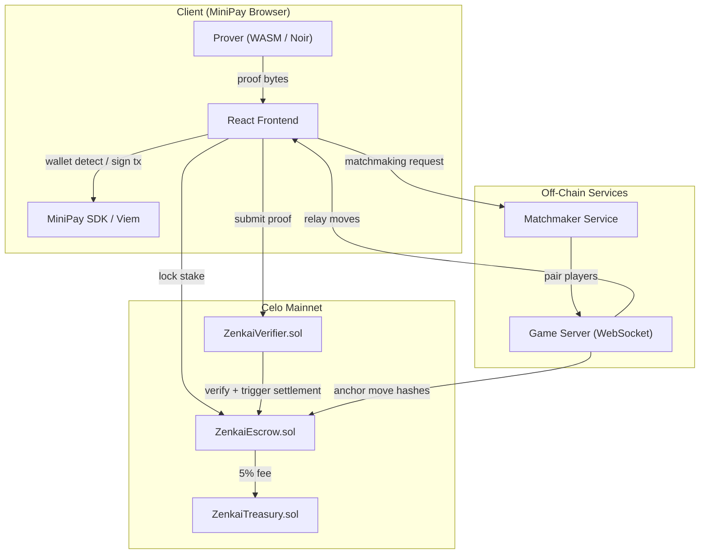
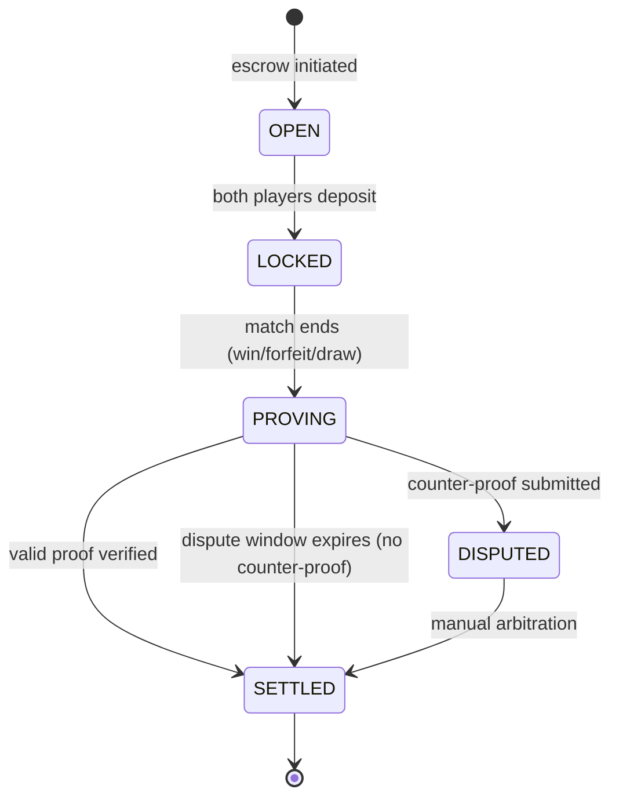
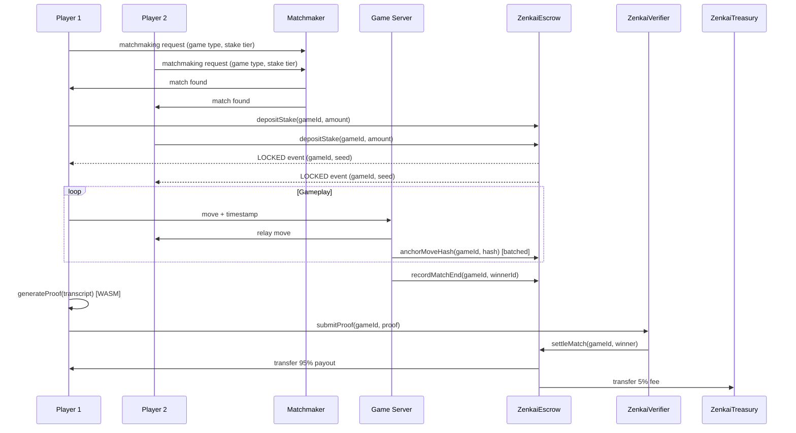

# Design Document: Zenkai App

## Overview

Zenkai is a decentralized Proof of Skill gaming protocol on Celo Mainnet. It enables competitive 1v1 matches (Chess and Trivia) where every result is verified by a Zero-Knowledge proof, ensuring provable fairness, bot resistance, and instant cUSD settlement via MiniPay — all without exposing users to blockchain complexity.

The system is structured around a 4-stage match loop:

1. **Escrow** — both players lock cUSD on-chain; a unique Game_ID and Randomness_Seed are committed.
2. **Gameplay** — moves are relayed off-chain at sub-100ms latency; move hashes are periodically anchored on-chain.
3. **ZK Proving** — the winner generates a Groth16 proof client-side (WASM) from the Game_Transcript.
4. **Settlement** — the proof is verified on-chain; 95% of the pot is released to the winner atomically.

The design prioritises mobile-first performance (targeting 2GB RAM / ARMv8 Android devices), minimal on-chain data, and a UX that hides all blockchain complexity behind MiniPay.

---

## Architecture

### High-Level Component Diagram



### Match State Machine



### Data Flow — Full Match



---

## Components and Interfaces

### 1. React Frontend

Responsibilities: wallet detection, matchmaking UI, game rendering (Chess board / Trivia questions), proof submission, dashboard.

Key modules:
- `WalletProvider` — wraps MiniPay SDK / Viem; exposes `address`, `balance`, `signTx`
- `MatchmakingScreen` — game type + stake tier selection; polls Matchmaker
- `GameScreen` — renders Chess or Trivia; connects to Game Server via WebSocket
- `ProverWorker` — Web Worker that runs the WASM Prover off the main thread
- `DashboardScreen` — match history, stats, Celoscan links

### 2. Matchmaker Service

A lightweight stateless HTTP + WebSocket service.

```
POST /queue          { address, gameType, stakeTier }  → { queueId }
GET  /queue/:id      → { status: "waiting" | "matched", matchId? }
WS   /match/:id      → bidirectional match coordination channel
```

Pairing logic: FIFO queue per (gameType, stakeTier) bucket. Times out after 60 seconds and returns `{ status: "timeout" }`.

### 3. Game Server

WebSocket relay with server-side timestamping.

```
WS /game/:gameId
  → client sends:  { type: "move", payload: <move_data> }
  ← server sends:  { type: "move", from: <address>, payload, serverTimestamp }
  ← server sends:  { type: "game_end", winner, transcript_cid }
```

The server:
- Stamps each move with `Date.now()` at receipt
- Batches move hashes and calls `ZenkaiEscrow.anchorMoveHashes()` every 10 moves or 30 seconds
- Detects 60-second disconnects and calls `ZenkaiEscrow.recordForfeit(gameId, forfeitingPlayer)`

### 4. ZenkaiEscrow.sol

Core state machine contract. Holds cUSD ERC-20 funds.

```solidity
// Key functions
function createMatch(bytes32 gameId, address p1, address p2, uint256 stakeAmount) external;
function depositStake(bytes32 gameId) external;                          // called by each player
function anchorMoveHashes(bytes32 gameId, bytes32[] calldata hashes) external; // game server only
function recordForfeit(bytes32 gameId, address forfeiter) external;      // game server only
function settleMatch(bytes32 gameId, address winner) external;           // verifier only
function settleMatchDraw(bytes32 gameId) external;                       // verifier only
function openDisputeWindow(bytes32 gameId) external;
function submitCounterProof(bytes32 gameId, bytes calldata proof) external;

// Events
event MatchLocked(bytes32 indexed gameId, address p1, address p2, uint256 stake, bytes32 seed);
event MatchSettled(bytes32 indexed gameId, address winner, uint256 payout);
event DisputeOpened(bytes32 indexed gameId);
```

Access control:
- `anchorMoveHashes` / `recordForfeit` — restricted to the registered Game Server address
- `settleMatch` / `settleMatchDraw` — restricted to the registered ZenkaiVerifier address
- Reentrancy guard on all cUSD transfer functions

### 5. ZenkaiVerifier.sol

Wraps the Groth16 verifier generated by Noir's `nargo` toolchain.

```solidity
function verifyAndSettle(
    bytes32 gameId,
    bytes calldata proof,
    bytes32[] calldata publicInputs   // [gameId, seed, winner, score/outcome]
) external returns (bool);
```

On successful verification, calls `ZenkaiEscrow.settleMatch()`. On failure, calls `ZenkaiEscrow.openDisputeWindow()`.

### 6. ZenkaiTreasury.sol

Minimal fee receiver. Accepts cUSD transfers; owner can withdraw.

### 7. ZK Circuit (Noir)

Two circuits sharing a common timing module:

**Chess Circuit** (`chess.nr`):
- Inputs: `game_id`, `seed`, `moves[]` (each: `{from, to, promotion?, timestamp}`), `winner`
- Constraints:
  1. All moves are legal per FIDE rules (including castling, en passant, promotion)
  2. All inter-move intervals ≥ 300ms (Human Timing Floor)
  3. Terminal state (checkmate / stalemate / timeout / fifty-move) matches declared `winner`
  4. White/Black assignment matches `seed`

**Trivia Circuit** (`trivia.nr`):
- Inputs: `game_id`, `seed`, `answers[]` (each: `{questionIndex, answer, timestamp}`), `score_p1`, `score_p2`
- Constraints:
  1. Question indices are derived from `seed` (deterministic selection)
  2. All inter-answer intervals ≥ 300ms (HTF)
  3. Declared scores match the answer correctness in the transcript
  4. Unanswered questions (> 10s) are counted as incorrect

### 8. WASM Prover

The Noir circuit is compiled to WASM via `nargo` + `bb.js` (Barretenberg). Runs in a Web Worker to avoid blocking the UI.

```typescript
// ProverWorker interface
interface ProverMessage {
  type: "prove";
  transcript: GameTranscript;
  gameId: string;
  seed: string;
}
interface ProverResult {
  type: "proof" | "error";
  proof?: Uint8Array;   // ~200 bytes Groth16 proof
  error?: string;
}
```

---

## Data Models

### GameTranscript

```typescript
interface GameTranscript {
  gameId: string;           // bytes32 hex
  gameType: "chess" | "trivia";
  seed: string;             // bytes32 hex — from Celo block hash at escrow
  player1: string;          // wallet address
  player2: string;          // wallet address
  moves: MoveRecord[];
  outcome: "p1_win" | "p2_win" | "draw" | "forfeit";
  winner: string | null;    // wallet address or null for draw
}

interface MoveRecord {
  player: string;           // wallet address
  payload: ChessMove | TriviaAnswer;
  serverTimestamp: number;  // ms since epoch, set by Game Server
  interMoveInterval: number; // ms since previous move by same player
}

interface ChessMove {
  from: string;             // algebraic notation e.g. "e2"
  to: string;               // algebraic notation e.g. "e4"
  promotion?: "q" | "r" | "b" | "n";
}

interface TriviaAnswer {
  questionIndex: number;    // 0–9
  answer: number;           // 0–3 (multiple choice index)
  answeredAt: number;       // ms since question was presented
}
```

### On-Chain Match Record (ZenkaiEscrow storage)

```solidity
struct Match {
    address player1;
    address player2;
    uint256 stakeAmount;       // per player, in cUSD wei
    bytes32 seed;              // randomness seed from block hash
    MatchState state;          // OPEN | LOCKED | PROVING | SETTLED | DISPUTED
    uint256 disputeWindowEnd;  // unix timestamp
    bytes32[] moveHashAnchors; // periodic anchors from Game Server
    address winner;            // set on settlement
}

enum MatchState { OPEN, LOCKED, PROVING, SETTLED, DISPUTED }
```

### Stake Tier Configuration

```typescript
const STAKE_TIERS = {
  practice: { stake: "100000000000000000",  // 0.10 cUSD (18 decimals)
               payout: "190000000000000000" },
  standard: { stake: "1000000000000000000",
               payout: "1900000000000000000" },
  pro:      { stake: "5000000000000000000",
               payout: "9500000000000000000" },
  elite:    { stake: "20000000000000000000",
               payout: "38000000000000000000" },
} as const;
```

### Player Profile (off-chain, indexed from on-chain events)

```typescript
interface PlayerProfile {
  address: string;
  matchHistory: MatchSummary[];
  totalWins: number;
  totalLosses: number;
  totalDraws: number;
  totalCUSDEarned: string;   // bigint string
  winRate: number;           // 0–1
}

interface MatchSummary {
  gameId: string;
  gameType: "chess" | "trivia";
  stakeTier: "practice" | "standard" | "pro" | "elite";
  outcome: "win" | "loss" | "draw";
  cUSDDelta: string;         // signed bigint string
  settledAt: number;         // unix timestamp
  celoscanTxHash: string;
}
```

---
